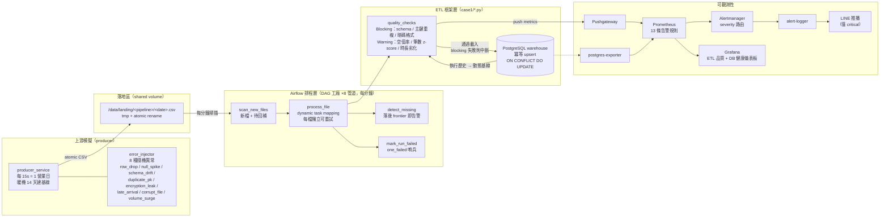
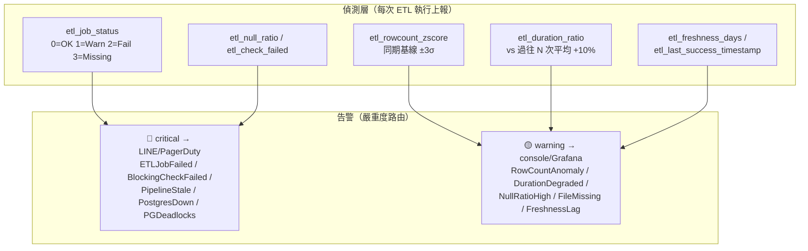

# Case 1 — 批次 ETL 資料品質與延遲監控體系

模擬保險數據湖場景：8 條每日批次管道由 Airflow 排程，producer 以固定節奏落檔並隨機注入
8 種典型異常，ETL 框架以兩級品質檢核攔截，指標全鏈路可觀測、告警分級路由。

## 架構圖



## 監控訊號 → 告警對應



## 核心設計

| 設計 | 實作 | 解決的問題 |
|------|------|-----------|
| 框架層 metrics 注入 | `metrics.push_run_metrics()`，所有 DAG 共用 | 新管道零成本接入監控 |
| Pushgateway push 模式 | 批次 job 結束時推送 | 短生命週期任務不適合 pull |
| 動態基線（同 weekday 類型 ±3σ） | `db.get_same_daytype_history()` | 抓「靜默掉量」這種無聲異常 |
| 時長劣化偵測（+10%） | `check_duration_baseline()` | 抓「沒失敗但變慢」 |
| 兩級檢核 | blocking 中斷載入 / warning 照常載入 | 防污染下游 vs 避免過度阻斷 |
| 冪等載入 | `ON CONFLICT DO UPDATE` | 重跑/回補不產生重複 |
| 缺檔偵測 + 自動回補 | frontier 比對 + MISSING 狀態覆寫 | 遲到檔案到位即自動補跑 |

## 快速操作

```bash
docker compose exec producer python inject.py encryption_leak policies   # 注入事故
docker compose logs -f producer                                          # 看注入記錄
# Airflow UI: http://localhost:18080（dataops/dataops）
# Grafana:    http://localhost:3000/d/case1-etl ・ /d/case1-db
```
