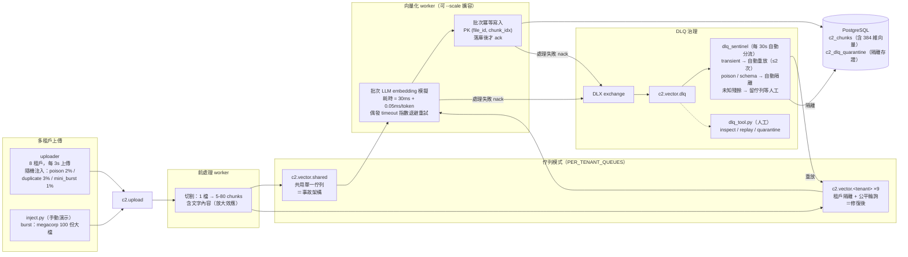
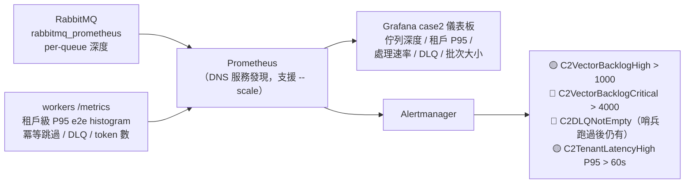

# Case 2 — 多租戶佇列檔案處理管道（RabbitMQ + LLM Embedding）

重現 SaaS 平台「大客戶突發上傳拖垮全體租戶（noisy neighbor）」事故，
與修復後架構的可切換對比，含 DLQ 全自動分流治理。

## 架構圖



## 監控與告警



## 事故重現：實測數據（同樣的 burst，兩種架構）

| 租戶 | 共用佇列（事故架構） | 租戶隔離（修復後） |
|------|:---:|:---:|
| megacorp（肇事者） | P95 98.8s | P95 112.8s（只有自己排隊） |
| globex | **107.2s** 💥 | **1.8s** ✅ |
| wayne | 51.7s | **0.9s** ✅ |
| 佇列積壓 | 全體共扛 | 只有 `c2.vector.megacorp` 積壓 |

```bash
docker compose exec case2-uploader python inject.py burst          # 事故架構下打爆
PER_TENANT_QUEUES=true docker compose up -d case2-preprocess case2-vector case2-dlq-sentinel
docker compose exec case2-uploader python inject.py burst          # 修復後：只有 megacorp 受影響
```

## 核心設計

| 設計 | 實作 | 解決的問題 |
|------|------|-----------|
| 租戶隔離佇列 + 公平輪詢 | 9 條佇列、prefetch 小值 | noisy neighbor |
| 批次 embedding | 16 chunks/批，攤平推論 overhead | 吞吐約 3 倍（vs 逐筆） |
| 冪等寫入 + ack-after-write | PK + `ON CONFLICT DO NOTHING` | at-least-once 下不丟不重 |
| DLQ 自動分流（sentinel） | 重放/隔離/留置三路 | DLQ 只剩真正需要人的訊息 |
| 預期外失敗模擬 | 暫時性（0.4%/chunk，重放可救）與黏性（hash 決定，重放無效） | 驗證哨兵 auto-replay 與 human-residual 兩條路徑 |
| schema 演進防護 | 缺欄位 → DLQ 而非 crash | 部署期間 in-flight 舊訊息 |
| flush 失敗整批 requeue | nack(requeue=True) | DB 抖動不丟資料 |
| 佇列深度告警 + DNS 服務發現 | per-queue 指標、`--scale` 即納入抓取 | 容量訊號 + 彈性擴容 |

## 快速操作

```bash
docker compose exec case2-uploader python inject.py poison        # → 哨兵 30s 內自動隔離
docker compose exec case2-uploader python inject.py duplicate     # → 冪等跳過
docker compose exec case2-vector   python dlq_tool.py inspect     # 人工檢視 DLQ
docker compose up -d --scale case2-vector=4                       # 水平擴容
# Grafana:  http://localhost:3000/d/case2-queue
# RabbitMQ: http://localhost:15672（guest/guest）
```
